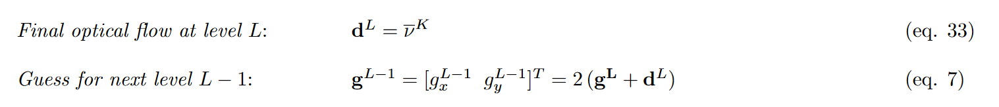
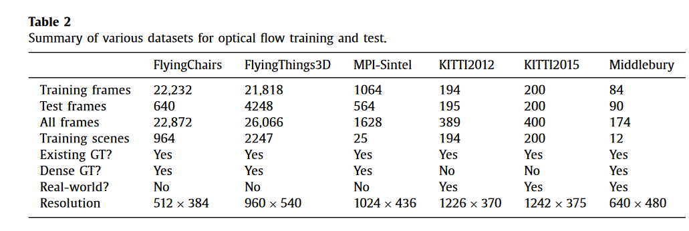

# LK光流


## Matlab的LK光流算法的实现

### F:\FPGA_prj\LK_Optical_Flow\soft\LK_Optical_Flow源码阅读

#### demo.m 

`my_opticalFlow(I1, I2, windowSize, tau)`函数用`tau`来剔除LK光流跟踪过程不匹配的特征点. 但这个函数没有考虑文献[1]的金字塔结构和LK光流矢量的迭代求解.

除此之外在文献[1]中还提到了低通滤波, 这里使用的是`imfilter(I1,dx,'replicate','same');`其中dx是居中差分的核`dx = [-1 0 1]./2;`参数`replicate`的代表在进行低通滤波的时候如果超出了边界, 采用最临界的像素点替代. 参数`same`代表滤波后输出的结果与I1的大小相同. 这个函数如果不指定滤波方法, 默认按照相关性进行滤波, 如果指定, 可以选择按照卷积进行滤波.

`quiver(x,y, u, v)`: matlab上画箭头的函数, 该函数会以点(x,y)为原点向右为u的正方向, 向上为v的正方向画出箭头.

`imagsec(C)`将数组C中的元素的值映射成一种颜色.


`LK_pyramid.m`实现图像金字塔的LK光流.

#### LK_pyramid.m

1. 构建图像金字塔:`Ia{k} = impyramid( Ia{k-1}, 'reduce' );`

`impyramid`在reduce模式下生成的图像大小为ceil(M/2)-by-ceil(N/2)(原图像$I_{M\times N}$), 选用的核函数为$w = \left[ \frac{1}{4}-\frac{a}{2}, \frac{1}{4}, a, \frac{1}{4}, \frac{1}{4}-\frac{a}{2} \right]$, 其中$a=0.375$

2. 对边界情况的处理

`I1 = expandBorder(Ia{l},w);` 


1. 迭代的处理

这里迭代的处理相当于是调用多次OpticalFlow. 这个函数实现的求解光流矢量的方法: 

$$
G \doteq \sum_{x=p_x-\omega_x}^{p_x+\omega_x} \sum_{y=p_y-\omega_y}^{p_y+\omega_y}\left[\begin{array}{cc}
I_x^2 & I_x I_y \\
I_x I_y & I_y^2
\end{array}\right] \quad \text { and } \bar{b} \doteq \sum_{x=p_x-\omega_x}^{p_x+\omega_x} \sum_{y=p_y-\omega_y}^{p_y+\omega_y}\left[\begin{array}{l}
\delta I I_x \\
\delta I I_y
\end{array}\right] .
$$

$$
\frac{1}{2}\left[\frac{\partial \varepsilon(\bar{\nu})}{\partial \bar{\nu}}\right]^T \approx G \bar{\nu}-\bar{b} = \bm{0} \tag{1}
$$

在这里并没有使用牛顿迭代的方法进行求解, 使用的感觉是一种公式求解一元二次方程组:

$$
G = \left[\begin{array}{cc}
g_{11} & g_{12}  \\
g_{22} & g_{21}
\end{array}\right] 
$$

$
令t=g_{11}+g_{22}, \quad d=g_{11}*g_{22}-g_{12}*G_{21} 
$

$$e_1=\frac{t}{2} + \sqrt{\frac{t^2}{4} -d}, \quad e_2 = \frac{t}{2} - \sqrt{\frac{t^2}{4} -d}$$

通过$e2 \lt \tau(阈值0.001), \quad or \quad  {{e_1}\over{e_2}} \gt 10 $则认为通过$\bar{\nu}_{\mathrm{opt}}=G^{-1} \bar{b}$估计出来的光流矢量是不准确的.

#### 和论文[1]的区别

1. 与论文中迭代的是式(1)不同, 代码中的让I2(下一帧图像)根据上一次迭代计算出来的(u,v)进行移动, 并在I2上用双三次插值计算移动后的像素点的值, 也就是说这里对时间梯度的值进行了迭代.

2. 在论文中即使是计算时间梯度, 也只需要使用第一帧图像, 但是在代码中使用了第2帧图像来计算时间梯度.

### F:\FPGA_prj\LK_Optical_Flow\soft\LKpyramid Codes源码阅读

#### pyramidFlow.M

`[flowHor flowVer] = pyramidFlow(I1, I2, 5, 3, 3);`
`[ u v H ] = pyramidFlow( A, B_in, winSize, ITER_NO, PYRE_NO )`: 

1. `sizeCheck( A, B_in, PYRE_NO );`修正图像的大小, 让图像大小是下采样率的整数倍. 对A和B都进行了imresize(默认使用双三次插值).
2. `[ Apyre, Bpyre, HalfWindow ] = pyramidInit( A, B_in, PYRE_NO, winSize );` 构建图像金字塔并初始化其他向量.
   1. `G = fspecial('gaussian',[3 3],1);` 返回一个2维滤波器. `[3 3]`为滤波器的大小, 这个标量指定了矩阵的行列. `1`是高斯函数的标准差. 在matlab中不推荐使用这个函数, 更加推荐imgaussfilt或者imgaussfilt3. 这里是用这个产生了旋转对称高斯低通滤波器.
   $$
    \begin{aligned}
    & h_g\left(n_1, n_2\right)=e^{\frac{-\left(n_1^2+n_2^2\right)}{2 \sigma^2}} \\
    & h\left(n_1, n_2\right)=\frac{h_g\left(n_1, n_2\right)}{\sum_{n_1} \sum_{n_2} h_g}
    \end{aligned}
   $$
   2. `Apyre{1} = conv2( A, G, 'same' );`对原图像进行高斯滤波, 产生金字塔的第一层图像. 参数`same`返回卷积中大小与 A 相同的中心部分。
   $$
    C(j, k)=\sum_p \sum_q A(p, q) B(j-p+1, k-q+1)
   $$
   p 和 q 会遍历所有可得到 A(p,q) 和 B(j-p+1,k-q+1) 的合法下标的值。
   3. 使用impyramid构建金字塔的后续图像.
3. 对于每层图像中的牛顿迭代, 使用的是Hessian矩阵.
Hessian Matrix常用于牛顿法解决优化问题，利用Hessian Matrix可判定多元函数的极值问题. 为了使问题简化，常常将目标函数在某点邻域展开成泰勒多项式来逼近原函数，此时函数在某点泰勒展开式的矩阵形式中会涉及到Hessian Matrix。

**感觉这个对单层矩阵中的最小二乘法迭代也没有按照论文的来.**

### pyramidLK.m 
```matlab{.line-numbers}
[cornersT, goodFeat] = ...
    pyramidLK(imgBase, newImg, sampleSize, corners, goodFeat, maxFeat,...
	       maxLevel, wX, wY, subPixRes, bBox, thresh)
% Purpose: Let u be a point on image I. Find its corresponding location v on image J. 
%          Implementation of the psuedo code from subsection 2.4 Summary of the pyramidal 
%          tracking algorithm in "Pyramidal Implementation of the Lucas Kanade Feature 
%          Tracker Description of the algorithm", Jean-Yves Bouguet, Intel Corporation
% input:
%        imgBase: pyramid image I
%        newImg: pyramid image J
%        sampleSize: vector of subsample sizes 降采样大小
%        corners: locations of trackable points in image I (size (2,n)), 一帧图像中的所有角点
%        goodFeat: locations of corners in imageBase
%        maxFeat: max number of features you want to track
%        maxLevel: maximum number of pyramid levels in the input images
%        wX: tracking window size X-direction
%        wY: tracking window size Y-direction
%        subPixRes: sub-pixel resolution accuracy threshold
%        bBox: pixels around the screen
%        thresh: 
%       threshold: threshold ratio multiplier for the selection of pixels greater 
%                  than the threshold*(maximum of the minimum eigenvalues for eaach pixel)
% output:
%        cornersT: The trackable points selected by the geature selector.
%        goodFeat: locations of the corners tracked
% history:
%         05/01/04 SLB initial revision
%%%%%%%%%%%%%%%%%%%%%%%%%%%%%%%%%%%%%%%%%%%%%%%%%%%%%%%%%%%%%%%%%%%%%%%
```
这个有点没看懂, 感觉少了点东西. 这个代码不是完整的.

### F:\FPGA_prj\LK_Optical_Flow\matlab\Lucas-Kanade-Motion-Field-Generation

这个代码是能够正常运行的，但并不是算的每个像素点光流矢量，而是算的一个窗口内的光流矢量。

这个代码的主函数为`quiver_overlay_sequence.m`

在这个函数函数里面用到二阶矩矩阵(second moment matrix), 这个矩阵也称为Hessian矩阵，和右手边向量(RHS), H矩阵就是公式(1)中的G矩阵，而RHS是一个2x1的向量，为公式(1)中的$b$

这个函数只有在G矩阵可逆时才计算光流矢量，否则光流矢量作为0.

这个函数padding的大小是1.5个window_patch。

它是按照金字塔最高层开始计算，从最上层到最下层。并且算出来的g_L，从上层传递到下层时少了个2倍的关系。由于是从最上层的索引到最下层的索引开始计算，所以它并没有算第一层的所有点在最高一层对应光流矢量。

在论文中无论是金字塔层之间的迭代还是当前层内的迭代, 计算出来的光流矢量都是改变的$J$中像素点的位置, 而这个实现的LK光流算法, 计算空间梯度时, 是先通过迭代计算出来的点在$I$中的位置计算得到的. 而时间梯度则是将两边的图像都进行移动后再进行计算.

并且从L层到L-1层传递的光流矢量, 第L-1层各点的光流矢量由第L层各点的光流矢量插值得来.

按照我的逻辑，金子塔LK光流矢量的计算方法：
1. 得到角点在第一层的坐标$(x_0,y_0)$
2. 计算其在最高一层的坐标$(x_{Lm}=y_0/2^{Lm-1},y_{Lm}=y_0/2^{Lm-1})$
3. 按照居中差分的方法计算以$(x_{Lm},y_{Lm})$为中心点, $[2w_x+3] \times [2w_y + 3]$LK_patch邻域内所有点的像素值
   * 如果涉及到了亚像素, 那么还需要得到$[2w_x+4] \times [2w_y + 4]$bi_patch邻域内所有坐标为整数点像素值, 通过双线性插值求出LK_patch内各个像素点的值.
4. 进行$K$次迭代, 求解出当层金子塔的光流矢量$[g_x^L, g_y^L]$

5. 得到当前层的像素点的光流失量.


## LK算法的metric 

1. 平均角度误差(AAE)
2. 平均端点误差(average endpoint error, AEE)
3. 平方根误差 Root-Mean-Square error (RMSE)
4. the percentage of outliers averaged over all pixels (Fl-all)




## Xilinx HLS实现的LK光流算法

Xilinx实现的LK光流算法, 参考的是matlab的`opticalFlowLK`函数, 该函数所实现的LK光流算法为无迭代的无金字塔的LK光流算法.


### HLS代码解析

HLS实现的LK光流算法的步骤:
1. 用5x5的低通滤波器对图像进行平滑, 提高图像的信噪比
2. 用5x5的卷积核计算图像$I$的像素点的空间梯度$I_x,I_y$. 然后用5x5的unitary filter延迟上一帧图像与当前帧做差得到时间梯度.
3. 在NxN的窗口内计算系数公式:
   
4. 解上诉矩阵求出像素点的光流矢量.

需要注意的是, 在上式中总共存在6个变量.


## 参考文献

### 1. Bouguet J-Y. Pyramidal Implementation of the Lucas Kanade Feature Tracker Description of the algorithm[J]. .

这篇文献主要介绍了多层金字塔的LK光流算法, 假设的是前后两帧图像没有仿射变化所以不会计算仿射变化矩阵A. 并且额外讲述了如何使LK光流算法达到亚像素精度, 如何处理图像的边界点情况.

### 2. Pyramidal Implementation of the Affine Lucas Kanade Feature Tracker Description of the algorithm

这篇文献除了使用金字塔之外, 还考虑了跟踪过程物体发生了形变, 估计了物体的仿射矩阵. 考虑的光照变化对LK跟踪结果的影响.


## appendix

### matlab函数的使用

#### imfilter的使用[^r1][^r2]

`g=imfilter(f,w,filtering_mode,boundary_options,size_optinos)`:

空间滤波操作有时候也被叫做卷积滤波，或者干脆叫卷积（离散的卷积，不是微积分里连续的卷积）；滤波器也有很多名字：卷积模版、卷积核、掩模、窗口等。


1. `corr`相关操作额运算过程:

假设有一个滤波窗口（也叫卷积核）h，一般为3*3的矩阵：


有一个待处理矩阵x：


corr操作即为将卷积核h的中心对准x的第一个元素，然后对应元素相乘后相加，没有元素的地方补0。


这样结果Y中的第一个元素值$Y(1,1)=-1\times 0+-2\times0+-1\times0+0\times0+0\times1+0\times2+1\times0+2\times5+1\times6=16$。

2. `conv`表示卷积操作, 运算过程如下:

第一步，**将卷积核翻转180°**，也就是成为了


第二步，将卷积核h的中心对准x的第一个元素，然后对应元素相乘后相加，没有元素的地方补0。

这样结果Y中的第一个元素值$Y(1,1)=1*0+2*0+1*0+0*0+0*1+0*2+-1*0+-2*5+-1*6=-16$

**最后提一点，很多中文书把相关操作叫做"卷积"。然而这个概念其实叫做相关，而卷积则相当于：将同样的模版旋转180°后，再做"相关"操作。当然，如果模版是180°对称的那么卷积和相关是相同的。但是并不是所有的模版都对称。因此，我建议，在滑窗操作、计算图像梯度等场合，不要使用“卷积”，而要使用“滤波”或者“相关”。因为，我们通常讲的卷积，其实是相关，那就不要用卷积这个词以免引起混淆。**


#### 网格函数meshgrid 

`[X,Y] = meshgrid(x,y)`: 基于向量 x 和 y 中包含的坐标返回二维网格坐标。X 是一个矩阵，每一行是 x 的一个副本；Y 也是一个矩阵，每一列是 y 的一个副本。坐标 X 和 Y 表示的网格有 length(y) 个行和 length(x) 个列。


#### 网格插值函数interp2

`Vq = interp2(X,Y,V,Xq,Yq)`: 该方法类似于实现对$f(x,y)$在未知点函数的插值. 使用线性插值返回双变量函数在特定查询点的插入值。结果始终穿过函数的原始采样。X 和 Y 包含样本点的坐标。V 包含各样本点处的对应函数值。Xq 和 Yq 包含查询点的坐标。X和Y都为一个行向量,分别代表点的x轴坐标和y轴坐标.

在`LK_pyramid.m`中用到了`Vq = interp2(V,Xq,Yq)`, 它相当于假定一个默认的样本点网格。默认网格点覆盖矩形区域 `X=1:n` 和 `Y=1:m`，其中 `[m,n] = size(V)`。如果您希望节省内存且不在意点之间的绝对距离，则可使用此语法。

#### 通过行向量产生卷积核

kron

[^r1]: imfilter的使用 https://blog.csdn.net/mrahut/article/details/81539435
[^r2]: imfilter的一维卷积过程和相关算子与卷积算子 https://blog.csdn.net/sxj0820/article/details/79867800

### HLS_lib

1. https://github.com/definelicht/hlslib, 这个仓库对Xilinx平台最有用.
2. https://github.com/sajjadt/affix这个参库是对图像算法进行了测试. 

使用HLS需要注意避免使用以下几点:
1. 函数指针
2. 指针到指针的传递
3. 动态申请内存空间.
4. 函数递归


https://www.youtube.com/watch?v=VSSyPskheaE