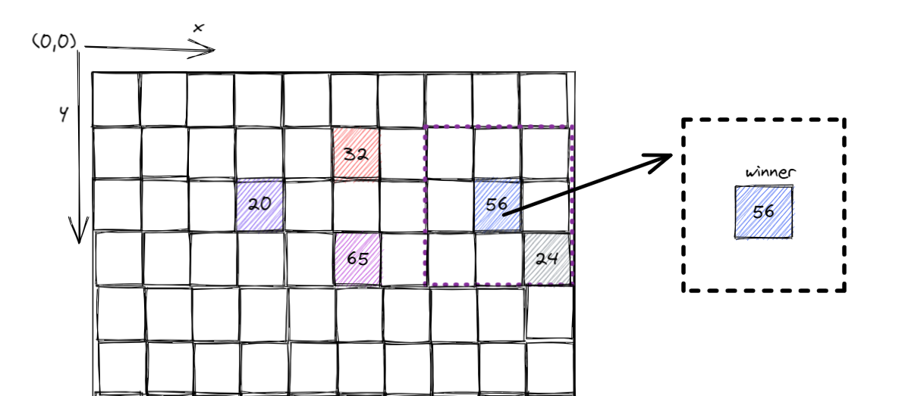
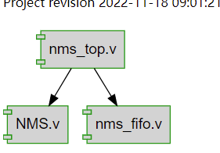
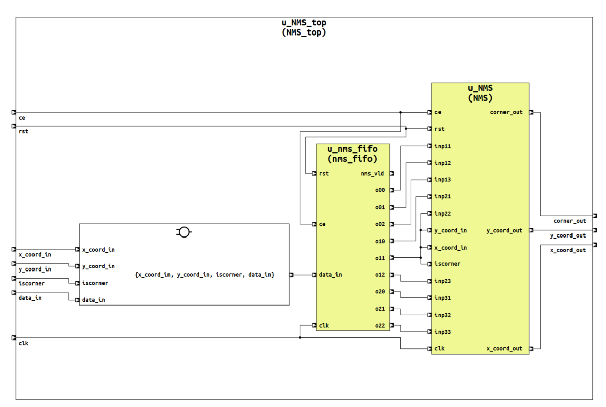
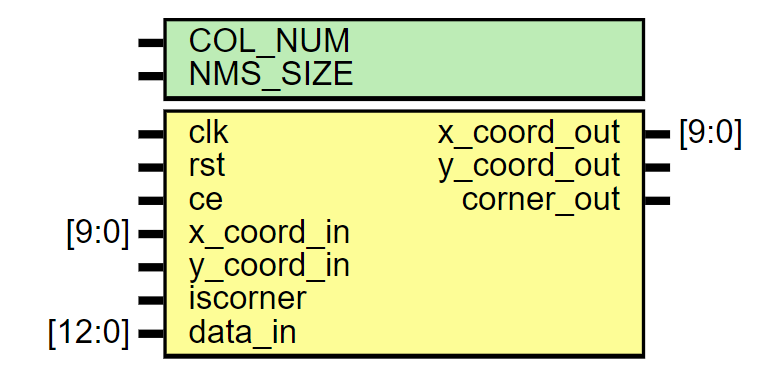
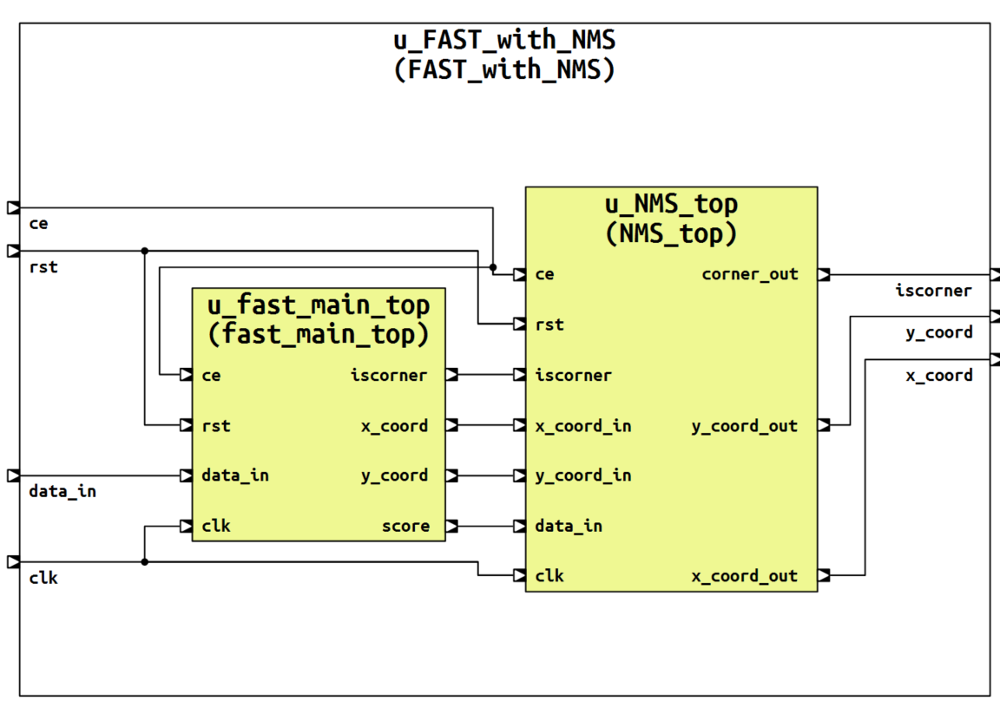
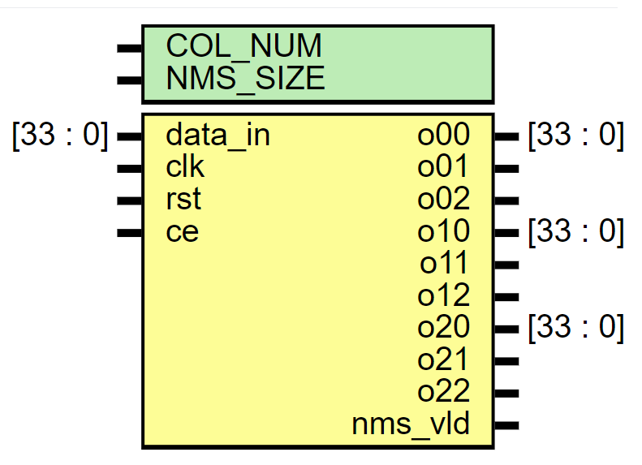

# 非极大值抑制模块

非极大值抑制: 设定窗口大小为3x3, 只保留窗口内分数最高的特征点, 其它特征点则抑制.

## verilog实现

NMS模块主要由3个文件实现: `NMS_FIFO.v`主要实现NMS的线缓存, 输出3x3的patch. `NMS.v`用于实现非极大值抑制. 通过比较patch中心点与其它8个点的大小, 2拍出结果.

  

  

### NMS.v

  

如上图所示, `NMS.v`的输入主要为角点的坐标`x_coord_in, y_coord_in`, 以及当前坐标的角点是否满足连续性判断`data_in`. 其输出为1个patch比较后的结果, 即patch中winner的坐标`x_coord_out, y_coord_out`和当前输出的坐标是一个FAST角点的有效信号`corner_out`.

### nms_fifo.v

FAST角点提取的整体逻辑框图如下:

  

nms_fifo的模块框图如下:

  

该模块的输入为34bit的`data_in([--x_coord(10)--|--y_coord(10)--|--iscorner(1)--|--score(13)--] total of 34 bits )`, 该数据中包含了从fast处理模块中输出的候选角点的坐标`x_coord, y_coord`, 该候选角点是否满足连续性判断`is_core`, 候选角点的分数`score`.

该模块的输出为3x3的patch, 该patch用于后续的`NMS`模块比较输出最终的`winner`的角点坐标.

## 下周内容

设计题目: 视觉惯导里程计(VIO)视觉前端的加速设计研究

1. 阅读视觉惯导里程计(VIO)的应用场景的相关文献
   * 主要有无人机/车的导航定位
   * SLAM建图.
2. 主流的视觉惯导里程计的技术框架, 需要强调框架中计算量比较大的模块
   * 基于滤波的VIO框架
   * 基于优化的VIO框架
3. 现有的VIO的加速方法
   * 对VIO中的哪一部分进行了加速
   * 使用的什么平台进行的加速
   * 最终实现的效果
   * 有什么缺点和不足
4. 最终引出我的VIO加速方法.
   * 解决的是VIO中的FAST特征提取和LK光流在FPGA上的加速.

