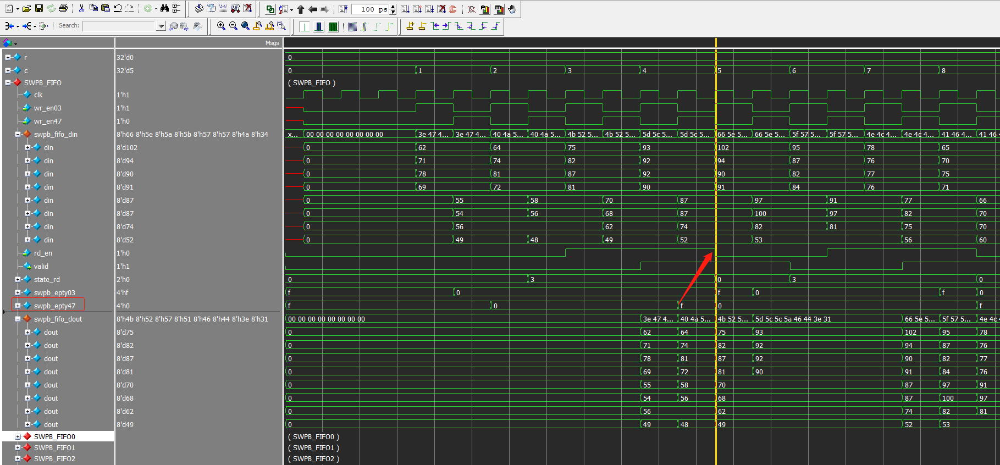
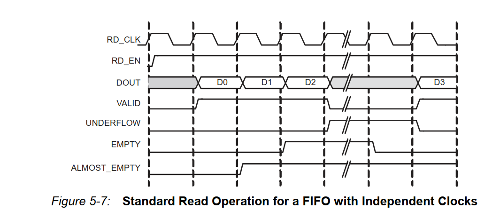

# 单窗口部分缓存设计的bug

:bug: 1. FIFO的读取控制

SWPB由8个输入位宽和输出位宽并行的小FIFO组成, 在写小FIFO时由于位宽是32bit, 所以需要先完成前4个FIFO的写, 然后再完成后4个FIFO的写, 所以一列8个像素点的数据, 需要分两拍来完成. 而读就不一样了, 读直接并行的从8个FIFO中将数据拿出去, 所以一拍获得8个8bit数据也就是64bit的数据.

genu写逻辑将FIFO分成了两段, 前面四个FIFO: `FIFO03`, 后面四个FIFO: `FIFO47`, 在进行FIFO的读逻辑控制时, 一开始预估的是只要FIFO03和FIFO47都为非空时, 就使能8个FIFO的`rd_en`, 在读取过程中, 如果FIFO03或者FIFO47有一个变为了空, 那么就拉低`rd_en`. 但是发现及时在检测FIFO为空的信号时, 即使拉低FIFO的读使能信号, 仍然会照成FIFO的下溢.

读逻辑如下:

```verilog{.line-numbers}
always @(posedge clk) begin 
    if (~rst_n) 
        state_rd <= IDLE;
    else 
        case (state_rd)
            IDLE: begin 
                if ( ~ ((|swpb_epty03) | (|swpb_epty47)) )      // 8个FIFO都非空
                    state_rd <= RD_SWPB;
                else 
                    state_rd <= IDLE;
            end
            RD_SWPB: begin 
                if ( (|swpb_epty03) | (|swpb_epty47) )          // 8个FIFO有某4个为空.
                    state_rd <= IDLE;
                else 
                    state_rd <= RD_SWPB;
            end
        endcase
end

// 使能fifo的rd_en, 注意从rd_en使能到有效的数据输出存在一个clk的延迟.
reg rd_en=0;
always @(posedge clk) begin 
    if (~rst_n) 
        rd_en <= 1'b0;
    else 
        case (state_rd)
            IDLE: begin 
                rd_en <= 1'b0;
            end
            RD_SWPB: begin 
                if ( (|swpb_epty03) | (|swpb_epty47) )          // 8个FIFO都为空
                    rd_en <= 1'b0;
                else 
                    rd_en <= 1'b1;
            end
        endcase
end
```



从上图可以看出, FIFO的写逻辑确实是一上一下进行写操作的, 读操作也确实在检测到FIFO47位空的时候就拉低了`rd_en`. 从图中可以看出, FIFO47在读取到第2个数据的时候FIFO其实就已经空了, 按照逻辑, `rd_en`只能维持2个clk的高电平, 但是在这里通过`empty`信号来触发`rd_en`拉低, `rd_en`维持了4个clk的高电平. 这里的4个clk可以分解成`2+2`, 第1个`2`是`rd_en`应该维持的高电平个数, 而的2个`2`是因为从`rd_en`输出, 到`empty`触发存在2个clk的延迟. 一般是存在1个clk的延迟, 但是我在生成FIFO的时候勾选了`register output`, FIFO的`read latency`是2.

:key: 所以解决方案是, 提前两个clk将emtpy信号拉高, 这样当FIFO中还有2个数据的时候emtpy就会拉高, 然后`rd_en`由于2个clk的`read latency`, 仍然会维持2个clk的高电平, 将FIFO中的剩余数据读出.


:bell: 在FIFO控制中, empty信号是在读取FIFO中最后一个数据的同时拉高的. 并且valid信号在读取了最后一个数据之后就会被FIFO自己拉低.

