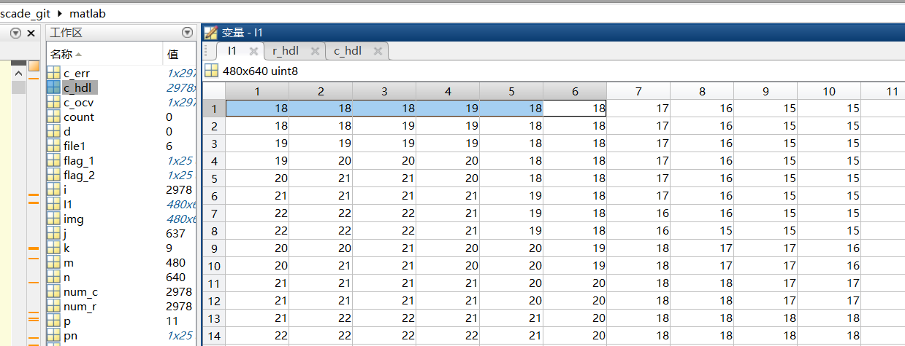

已经完成fast_score的源代码的设计, 紧接着需要完成对连续性判断的验证, 以及DMA接口的设计.

  
  

## 各个模块的延迟分析

  

在第一个时钟沿, 第一个patch的数据刚刚来到阈值(`threadsholder`)模块,因此在该上升沿采样到的数据不是第一个patch的数据, 在第一个时钟沿`#1step`之后, 驱动patch相关的信号变为第一个patch的数据, 即第一个patch的数据进入阈值模块.

在第二个时钟沿, 采样到第一个patch的数据, 并在该时钟沿`#1step`之后计算出`cmr`和`rmc`值并驱动`cmr`和`rmc`信号变化.

在第三个时钟沿, 采样到`cmr`和`rmc`值, 并在该时钟沿`#1step`之后计算`cmrt`和`rmct`值并驱动`cmrt`和`rmct`信号变化.

在第四个时钟沿, 采样到`cmrt`和`rmct`值, 并在该时钟沿`#1step`之后计算`oxd`和`oxb`, `bright`和`dark`, 并驱动这些信号变化.

因此, 从第一个patch的数据来到阈值模块, 到阈值输出正确的信号, 延迟了3个时钟周期.

  

在第一个时钟沿, 阈值模块刚刚驱动`oxd`和`oxb`信号输出正确的值, 因此在该时钟沿score值计算模块(`compute_score`)并没有采样到第一个patch所对应的`oxd`和`oxb`信号.

在第二个时钟沿, score值计算模块采样到第一个patch所对应的`oxd`和`oxb`信号, 并在该时钟沿`#1step`之后计算`sxb`和`sxd`的值, 驱动`sxb`和`sxd`信号改变.

在第三个时钟沿, 采样到`sxb`和`sxd`的值, 并在该时钟沿`#1step`之后计算`ssxb`和`ssxd`的值, 驱动`ssxb`和`ssxd`信号改变.

在第四个时钟沿, 采样到`ssxb`和`ssxd`的值, 并在该时钟沿`#1step`之后计算`sssxb`和`sssxd`的值, 驱动`sssxb`和`sssxd`信号改变.

在第五个时钟沿, 采样到`sssxb`和`ssxd`的值, 并在该时钟沿`#1step`之后计算`sum_all_b`和`sum_all_d`的值, 驱动`sum_all_d`和`sum_all_d`信号改变.

在第6个时钟沿, 采样到`sum_all_b`和`sum_all_d`的值, 计算第一个patch所对应的score值, 并驱动`score`信号改变.

因此, 从阈值模块输出第一个patch的`oxd`和`oxb`信号到score计算模块开始, 到score计算模块输出第一个patch所对应的score值, 经过了5个时钟周期的延迟.

综上, 从第一个patch的数据到达阈值模块门口(信号还未传达到模块内部)开始, 到输出第一个patch的score值, 总共经过了8个时钟周期的延迟.

  

连续性判断模块的延迟也为5个时钟周期. 从阈值判断模块驱动`bright`和`dark`信号到达连续性判断模块门口开始, 到连续性判断模块输出第一个patch所对应的连续性标志信号, 经过了5个clk的时钟周期的延迟.

## 对于坐标的延迟

首先对于x坐标的延迟, 由于当实际坐标到达patch的第7列数据时, 该patch对应的是第4列角点的计算, 所以需要延迟3个时钟周期. 又由于从`data_in`到数据进入`fast_fifo`模块内有1个时钟周期的延迟, 所以对于x坐标需要延迟4个时钟周期.

对于y坐标的延迟, 由于当实际坐标到达patch的第7行数据时, 该patch对应的是第4行角点的计算, 所以首先需要**延迟3行(也就是3*640个时钟周期)**, 同时需要将y坐标与x坐标同步, 所以需要再延迟4个时钟周期, 又由于从行结束信号(`EOL`)到`cnt_row`信号存在1个时钟周期的延迟, 所以y坐标在延迟了3行之后, 需要再延迟5个时钟周期才能够与x坐标同步.


## 加入NMS后存在的问题

### NMS会处理无效值

  

从上面的图可以看出, 在坐标为(77,0)时, FAST的连续判断模块, 判断该角点为连续, 但是很明显这个是不对的, 这是因为当(77,0)这个点输入后, 在patch中的数据, 还保存了每一行最后几个的数据. 

  

这个图是当中心点为(78,4)(matlab中以1为起点)时, patch中对应存储的数据. 

  

  

这个图是当中心点的坐标为(77,0)时patch中的数据, 从图中可以看出, 这个patch中的数据还保存了上面几行末尾的数据. 

目前想到的解决办法是, 在NMS中将数据存储到fifo中时, 进行筛选:

```verilog{.line-numbers}
if (data_in[13] & xy_coord_vld) begin
    ram0[address_write_d]<=data_in; 		// data input to delay buffer 0
    {o_20, o_21, o_22} <= {o_21, o_22, data_in};
end else begin
    ram0[address_write_d]<={data_in[33 -: 20], 14'd0};
    {o_20, o_21, o_22} <= {o_21, o_22, {data_in[33 -: 20], 14'd0}};
end

ram1[address_write_d]<=data_out_0; 	// data input to delay buffer 1

data_out_0<=ram0[address_read_d];  	// read FIFO 0
data_out_1<=ram1[address_read_d];  	// read FIFO 1

{o_00, o_01, o_02} <= {o_01, o_02, data_out_1};
{o_10, o_11, o_12} <= {o_11, o_12, data_out_0};   
```

加入只有当前输入的数据是角点, 并且坐标有效, 才会将对应的score值存入fifo, 否则score值和iscorner都存储0.

## FAST+NMS的延迟分析

### FAST延迟回顾

首先FAST的fifo需要先缓存6行+7个数据之后才能输出正确的score值, 在缓存结束之后, 后续的score值一拍出一个, 连续性判断也是一拍出一个, 但是需要注意的是, score值的计算和连续性判断结果的输出在数据的无效区域也会进行. 

  

在图中展示了6个需要关注的点, `cnt_row`为一帧图像的行索引, 当前为6, 表示一帧图像的第7行已经开始进入FIFO. 换而言之, FIFO的6行线缓存已经缓存一帧图像第1-6行. `EOL`为一行图像数据进入fifo的最后一个数据, 但是需要注意, 由于`EOL`的判决条件为`address_read == COL_NUM-2`, **即`EOL`在`addr_read`为638时就开始拉高, 在`addr_read`为639时采样到高电平, 而此时`addr_write`才计数到638, 也就是一行图像数据还差一个没有写入fifo,** 但这个不影响FAST模块的工作, 因为这其实相当于`EOL`信号提前了一个clk, 而`EOL`的作用主要用于延迟`y_coord`, 从图下中可以看出,`y_coord`相比于`cnt_row`延迟了3行(3*640)+13个clk, 而`x_coord`相比于`address_write`延迟了12个clk, 这里的12个clk对应了FAST模块从拿到patch中的数据到输出对应的score值的延迟(8个clk)加上输出中心点坐标的延迟(4个clk). y坐标在延迟了3行个时钟后, 为了实现x,y坐标的同步, 按理说应该将y坐标延迟12个clk, 但在这里延迟了13个clk, 这是因为`EOL`信号相比于真正的行结束信号, 提前了一个clk, 所以在y坐标需要额外延迟1个clk.

  

在这里可能会有疑问, 为什么不让`EOL`信号在`address_write == COL_NUM-1`时才拉高?

  

如上图所示是将`EOL`在`address_write == COL_NUM-1`时才拉高后, 可以看到`cnt_row`的0没有检测到, 这是因为`EOL`信号在`cnt_row`跳变后才拉高.

  

而在FIFO已经缓存了6行数据, 并且经过了7个clk之后, 此时patch中存放了第一个patch的数据, 且`patch_7x7_vld`信号才会拉高, 表示这期间的patch都是有效的patch. 而坐标的有效信号`xy_coord_vld`相比于patch的有效信号又延迟了8个clk.

  

综上所述, 在FAST FIFO已经缓存了6行数据之后, 并经过7个clk得到第一个有效的patch之后, 需要经过8个clk的延迟才能得到对应的score值和连续性判断. 这里需要注意, 坐标的延迟和结果的延迟是分开的, 即坐标仅仅是将cnt_row和address_write进行延迟, 而这里为了在输出patch的结果时, 输出的坐标不是patch(7,7)的坐标, 而是patch(3,3)的坐标, 所以坐标的延迟相比于结果的延迟额外加了4个clk, 总共12个clk.

FAST在输出第一个score值之后, 都是一个clk出一个score和连续性判断, 但FAST在数据的无效区域也会输出score和连续性判断, 并将结果输出给下级的NMS模块.

  

从上图中可以看出FAST模块在数据无效(`xy_coord_vld`为低时仍然会输出连续性判断和score值), 但这很明显式错误的输出结果. 解决方案在NMS处理无效数据中讲出了. 

### NMS的延迟

在加入NMS后, 首先NMS需要缓存2行+3个有效的score值, 所以这里又会引入额外的2*640+3个clk的延迟. 除此之外, NMS模块存储数据进FIFO的时间也需要注意. NMS模块中的`address_write`需要和FAST_FIFO中的`address_write`保持同步, 只有这样NMS_FIFO中才能存储有效的score值, 角点坐标, 连续性判断, 否则NMS_FIFO中存储的数据与FAST输出的数据会存在延迟, 导致NMS模块失效. 除此之外, 为了更好地观察NMS的数据存储状态, NMS与FAST_FIFO中的列坐标也保持了同步, 但延迟了6行, 这样当FAST输出的角点坐标为(3,x)时, NMS则正在存储第一行的数据.

  

NMS中也加入了nms_vld用于表示NMS patch的有效时间. 在NMS缓存了2行+3个score值之后拉高, 并在倒数第3个数据拉低.

  

FAST输出的数据到NMS, NMS将数据写入FIFO存在1个clk的延迟. 如下图所示, FAST输出的(0,3)的数据到达NMS模块, 但是在下一个时钟沿(0,3)的数据才写入NMS的FIFO中. 其实FAST_FIFO的data_in到达FAST模块, FAST将数据写入FIFO也存在一个clk的延迟.

  

如下图所示, NMS的第一个patch有效到NMS输出第一个patch所对应的比较结果, 存在2个clk的延迟. 可能会疑问, 为什么NMS中没有对坐标进行额外的延迟, 让patch输出的是中心点的坐标, 但是最后NMS输出的非极大值抑制之后的角点坐标正好是patch中心点坐标? 这是因为FAST传入NMS的数据不仅仅是score值, 它还包括了该像素点坐标, NMS在进行完非极大值抑制之后, 输出的是中心点的坐标, 所以这里不需要向FAST的patch那样进行额外的坐标延迟操作. 

  

NMS patch的有效时间为patch的中心点为1-638时, 如果nms_vld使用`((nms_y_coord>(NMS_SIZE-2)) && (address_read_d>(NMS_SIZE-2)))`的判决条件, 然后在延迟一个clk, 最终输出的nms_vld如下. 在中心点的列坐标为639时, 虽然nms_vld信号拉低了, 但是在这可的时钟沿采样nms_vld仍然是为高电平的, 所以仍然会认为此刻的nms输出有效的, 因此需要将nms_vld的判决条件改为`((nms_y_coord>(NMS_SIZE-2)) && (address_read_d>(NMS_SIZE-2)) && (address_read_d<(COL_NUM-1)))`

  


## ce的问题

这里还需要注意`ce`拉高的时间, 如果ce和data一起进入FAST模块,如下所示. 此时可以看到由于address_write和address_read相关, 且滞后其一个clk这就造成, 第一个写入ram的值会被覆盖掉.

```verilog{.line-numbers}
always @(posedge clk) begin
    if (rst) begin
        cnt_row<=10'd0;
        address_read<=10'd0;
        address_write<=10'd1;
    end else if (ce) begin
        // finish one line of frame transfer
        if (address_read == (COL_NUM-1)) begin
            address_read <= 10'd0;
            // finish one frame transfer
            if (cnt_row == (ROW_NUM-1))
                cnt_row <= 10'd0;           // counter of row that have been transferred
            else
                cnt_row <= cnt_row + 10'd1;
        end else  
            address_read <= address_read + 10'd1;
        address_write <= address_read;
    end
end
```

address_read与address_write的关系如上所示.

  

  

第一行的数据有3个18, 但实际写入ram中的数据只有2个18. 这就造成, 第一行本应该写入640个数据, 但由于第一个写入的数据被覆盖, 实际只写入了第一行的后639个数据, 并且第640个数据写入的是第二行的第一个数据.

  

  

解决方法有两种, 一种是在数据输入到FAST+NMS模块时, 由数据提供方额外加一个冗余数据, 另外一种, 在FAST模块内, 输入的数据进行一拍的延迟. 这里选用第二种方法:

```verilog{.line-numbers}
wire [PIXEL_WIDTH-1 : 0] data_in_d;
genvar i;
generate for(i=0; i<PIXEL_WIDTH; i=i+1) begin : delay_data_in
    // 延迟11拍 4+8, 8: 3(thresholder)+5(compute_score)
    // 4: 0, 1, 2, 3(output this addr), 4, 5, 6 (1 line of patch)
    delay_shifter#(1) u_delay_data_in(clk, ce, data_in[i], data_in_d[i]);
end
endgenerate
```

实现效果如下所示:

  


## trick

如果写入的数据存在**1**个冗余的数据, 并且这些冗余数据在有效数据的前面, 可以通过修改数组索引的初始值来丢弃冗余数据. 比如在有效数据前右2个冗余数据, 那么可将数组索引的初始值设为1, 数组索引从0开始递增, 那么初始写入索引为1的数据会被后续写入的数据覆盖. 