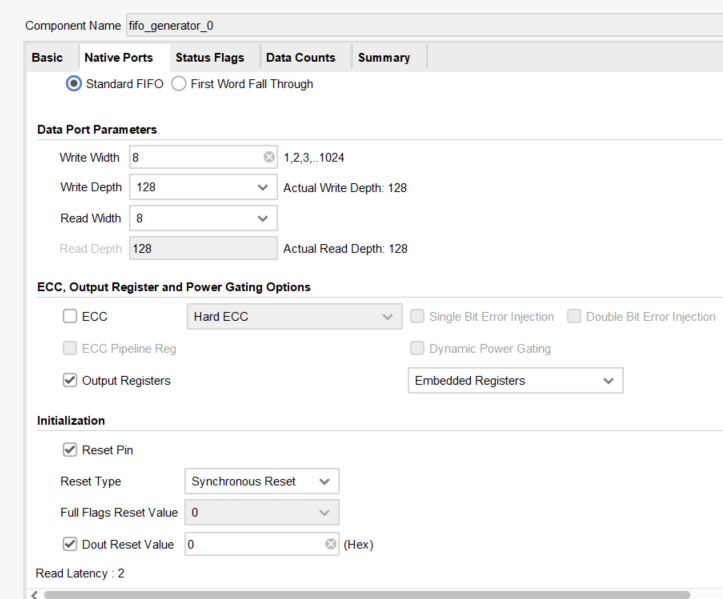
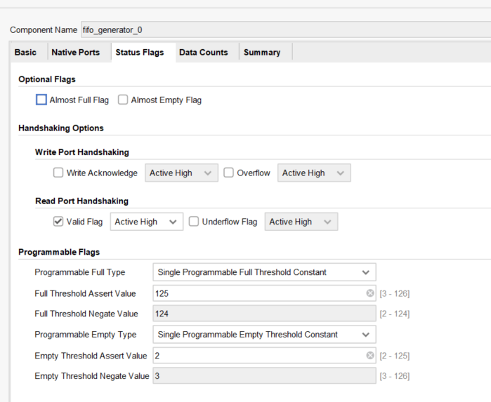
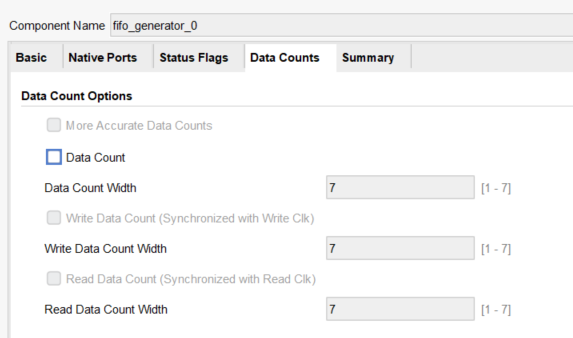

# 0609

初步完成了SWPB buffer的读写逻辑, 后续需要在这个基础上完成FAST角点提取的后续逻辑.

FIFO的配置如下:

后续可以尝试不使用output register, 用almost_empty作为SWPB启动读取逻辑的条件. 然后通过prog_empty控制SWPB在存储了一定量的数据之后再进行读取, 这样也相当于从SWPB中进行burst读取, 且burst长度够长, 可以提高带宽的利用率. 