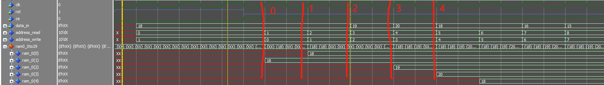
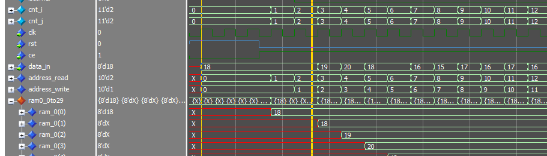

# FPGA FAST特征提取实现总体框架


$$
\text { score }=\max \left(\sum_{x \in S_{\text {bright }}}\left|I_{p \rightarrow x}-I_p\right|-t, \sum_{x \in S_{\text {dark }}}\left|I_p-I_{p \rightarrow x}\right|-t\right) \tag{1}
$$

整个FAST特征提取模块分为FAST候选角点处理和非极大值抑制(NMS)两个部分. 其中FAST候选角点处理包含6个行buffer(ram0~ram5), 一个7x7的patch, 阈值处理模块, score函数和连续性判断模块. 非极大值抑制包含2个行buffer和一个3x3的patch.

## 阈值处理模块

第一拍计算$rmc = I_{p\rightarrow x}-I_p$和$cmr = I_p- I_{p\rightarrow x}$, 第二拍计算$rmct = rmr-t$和$cmr = cmr-t$, 第三拍通过比较$rmc$和$cmr$的正负可以判断连续性条件.

## score函数

使用4拍计算16个$rmc$和$cmr$的相加, 第5拍输出结果.

```vhdl{.line-numbers}
always @(posedge clk) begin
    s0d<=resize(unsigned(i0d), s0d'length)+resize(unsigned(i1d), s0d'length);
    s1d<=resize(unsigned(i2d), s1d'length)+resize(unsigned(i3d), s1d'length);
    s2d<=resize(unsigned(i4d), s2d'length)+resize(unsigned(i5d), s2d'length);
    s3d<=resize(unsigned(i6d), s3d'length)+resize(unsigned(i7d), s3d'length);
    s4d<=resize(unsigned(i8d), s4d'length)+resize(unsigned(i9d), s4d'length);
    s5d<=resize(unsigned(i10d), s5d'length)+resize(unsigned(i11d), s5d'length);
    s6d<=resize(unsigned(i12d), s6d'length)+resize(unsigned(i13d), s6d'length);
    s7d<=resize(unsigned(i14d), s7d'length)+resize(unsigned(i15d), s7d'length);

    ss0d<=resize(unsigned(s0d), ss0d'length)+resize(unsigned(s1d), ss0d'length);
    ss1d<=resize(unsigned(s2d), ss1d'length)+resize(unsigned(s3d), ss1d'length);
    ss2d<=resize(unsigned(s4d), ss2d'length)+resize(unsigned(s5d), ss2d'length);
    ss3d<=resize(unsigned(s6d), ss3d'length)+resize(unsigned(s7d), ss3d'length);

    sss0d<=resize(unsigned(ss0d), sss0d'length)+resize(unsigned(ss1d), sss0d'length);
    sss1d<=resize(unsigned(ss2d), sss1d'length)+resize(unsigned(ss3d), sss1d'length);

    sum_all_d<=resize(unsigned(sss0d), sum_all_d'length)+resize(unsigned(sss1d), sum_all_d'length);
end
```

## 连续性判断

通过查找表判断连续性是否满足.

```vhdl{.line-numbers}
if std_match(input_b, "111111111-------") then
    contig_b<='1';
elsif std_match(input_b, "-111111111------") then
    contig_b<='1';
elsif std_match(input_b, "--111111111-----") then
    contig_b<='1';
elsif std_match(input_b, "---111111111----") then
    contig_b<='1';
elsif std_match(input_b, "----111111111---") then
    contig_b<='1';
elsif std_match(input_b, "-----111111111--") then
    contig_b<='1';
elsif std_match(input_b, "------111111111-") then
    contig_b<='1';
elsif std_match(input_b, "-------111111111") then
    contig_b<='1';
elsif std_match(input_b, "1-------11111111") then
    contig_b<='1';
elsif std_match(input_b, "11-------1111111") then
    contig_b<='1';
elsif std_match(input_b, "111-------111111") then
    contig_b<='1';
elsif std_match(input_b, "1111-------11111") then
    contig_b<='1';
elsif std_match(input_b, "11111-------1111") then
    contig_b<='1';
elsif std_match(input_b, "111111-------111") then
    contig_b<='1';
elsif std_match(input_b, "1111111-------11") then
    contig_b<='1';
elsif std_match(input_b, "11111111-------1") then
    contig_b<='1';
else
    contig_b<='0';
end if;
```

## LK光流跟踪算法


## 代码讲解

`cmr0 <= signed( "00" & center ) - signed( "00" & in0 );`, 其中`center`, `in0`为8bit变量, `"00"`在vhdl中表示二进制串, `signed("00" & center)`表示将center与2个bit`"00"`进行位拼接, 这里之所以是两个bit而不是8个bit是因为, 在vhdl中16进制的二进制串的表示为:`X"00"`, 然后将9bit的结果转为有符号数, 需要注意的是,对于有符号数, 是按照补码进行存储的.

`resize(unsigned(i0b), s0b'length)`, 按照`S0`的长度对`i0b`进行符号扩展. 这个函数只能针对`unsigned`和`signed`类型.


## bug 

当`input_fifo.vhd`中的address_generator进程中的`address_write<=to_unsigned(1, 10);`设置address_write的初值为1时, 会存在初始状态少输入一个数据的bug. 这里设WA的初始值为1, 可以把多写进去的data_in的初始值0给去掉.

要写入的数据为`18 18 18 19 18 18 17 16 15 15 15 15 15`, 可以看到, 首先第一个数据写入了ram0的第2个位置, 而在第2拍时, 应该向第三个位置写入的`18`, 仍然写入的是第二个位置, 覆盖了第一拍写入的`18`.

  

上诉分析有错误, 最终移位寄存器,会存储到那个18. 但如果address_write的初始值为0的话, 那就是真的丢失了一个数据了.

  


问题2: 7patch在更新新的一行时, 一开始至少需要等待7个clk才能实现后续每一个clk计算一个patch. 